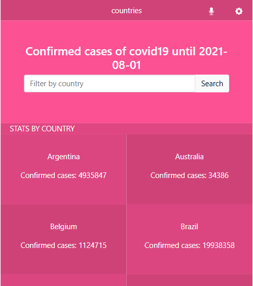
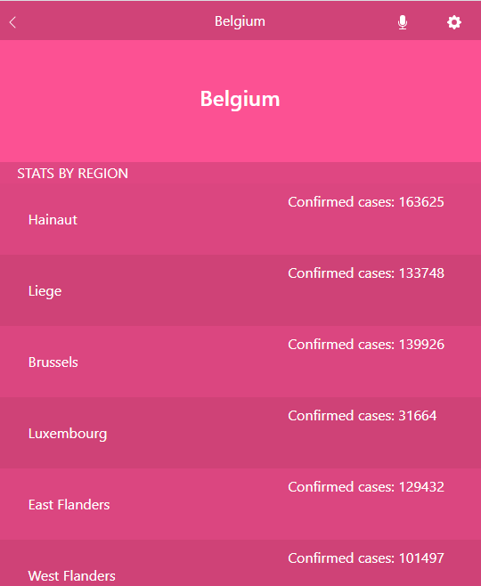

# Metrics Webapp

> This app consumes the [Narrativa API](https://covid19tracking.narrativa.com/index_en.html) and shows a list of several countries and the confirmed covid cases of each one until 2021-08-01.

This app has 2 views

- Countries view: shows a list of several countries and the confirmed cases.
- Regions view: shows a list of regions in the chosen country.

## Built With

- HTML/CSS
- React
- Redux
- Bootstrap
- Javascript
- Jest

## Live Demo

[Live Demo Link](https://metrics-webapp-loctavio.netlify.app/)

## Getting Started

To get a local copy up and running follow these simple example steps.

### Prerequisites

 - Node >= 10.16
 - npm >= 5.6

### Setup

  - run 'git clone https://github.com/LOctavio/metrics-webapp' to clone the project

### Install

  - run 'npm install'

### Usage

  - open th project directory and you will see all the project files

### Run tests

  - run 'npm run test'

### Deployment

 - run 'npm start' to run the server

## Authors

👤 **Luis Octavio Ramirez Cruz**

- GitHub: [LOctavio](https://github.com/LOctavio)
- Twitter: [@Octavio_ram431](https://twitter.com/Octavio_ram431)
- LinkedIn: [Luis Octavio Ramirez Cruz](https://www.linkedin.com/in/luis-octavio-ramirez-cruz/)

## 🤝 Contributing

Contributions, issues, and feature requests are welcome!

Feel free to check the [issues page](https://github.com/LOctavio/metrics-webapp/issues).

## Show your support

Give a ⭐️ if you like this project!

## Acknowledgments

- Hat tip to anyone whose code was used
- Inspiration
- etc

## 📝 License

This project is [MIT](./MIT.md) licensed.